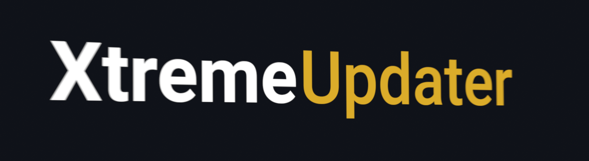

# XtremeUpdater

Welcome to XtremeUpdater repo. This software's task is to improve mainly video games performance, but can be used for increasing performance of almost **any** app. XtremeUpdater also contains *Game Collection* for easy game management and ~~loads~~ (not that much actually) of system tweaks to improve your overall system performance.

**[Download](https://github.com/XtremeWare/XtremeUpdater/releases/download/Installer/XtremeUpdater-Setup.exe)**

Website is located at https://xtremeupdater.com.
Support and chat at [discord](https://discord.gg/ZD6rxw9).
The binaries at the [distribution repo](https://github.com/XtremeWare/XtremeUpdater-Distribution)

## v0.7.2
**Bugfixes**
  - Fixed the *Play now* button.
  - Fixed scanning directories to be enormously slow in some cases.

**Other**
  - A lasting notification will be shown when scanning dlls.
  - Added an option to hide the *Run as admin* button.

## v0.7.1
**Bugfixes**
  - Fixed bug causing the *Export logs* button to try to export logs from a bad directory.

## v0.7.0
**Features**
  - Added *Run as admin* button.
  - Added support for *theming*.
  - Added *Donate* button to *Settings*.

**Bugfixes**
  - Fixed bug causing buttons to sometimes have unexpected colors.
  - Fixed incorrect *LabelIconButton* background color.
  - Fixed bug causing *Navigation buttons* to sometimes have incorrect text color.
  - Fixed bug causing *GameDVR* tweak to crash the app on startup if the machine is running *Windows Server 2016*.
  - App now does not close when UAC prompt is rejected.
  - *Sync popup* now does not close itself when clicking outside of it.
  - Fixed bug causing an app crash if a dll that was attempted to restore was not backed before.

**Tweaks**
  - Everything now scrolls smoothly.
  - Icon buttons in the *Game Collection* now have always a contrast color.
  - Restored dlls are now deletd from the backup directory.
  - *Path input* now changes text color depending on whether entered path exists or not.

**Other**
  - Added *Night Roses* theme.
  - Changed logging directory.
  - Logger now loggs System information.

## v0.6.0
*We have changed the default way of updating dlls. Selective update is now secondary feature.*

**Features**
  - Added a *tweak* to clear *FTH*.
  - Added a *tweak* to disable *FTH*.
  - *XtremeUpdater* now remembers which dlls you updated the last time.
  - Added *Export logs* option to the options.
  - Added *Show license* button to the options.
  - Removed *Quickupdate* button from the *Game Collection* as it is now the default way of updating dlls.
  - Removed *Subdir view* and features connected with it as *XtremeUpdater* now includes subdirs defaultly.

**Tweaks**
  - *System* tab is now calld *Tweaks*.
  - Tweaked *progressbar*.
  - Added more description to *error popups*.
  - Reworked *popups*.. again.
  - Tweaked animations.
  - Dll backing is now more reliable.
  - You can now proceed custom game adding with the *Enter* key in the *Game Collection*.
  - Added *Is running as admin* notification when entering the *Tweaks* tab.

**Bugfixes**
  - Fixed bug causing sometimes to display empty dll list instead of an error.
  - Fixed bug causing flickering of background of some buttons.
  - Fixed bug causing buttons to not have on-hovering colors after recovering from *disabled* state.
  - Fixed potencial compatibility issues.
  - Fixed bug causing *Launchable file* entry to be not functional.

## v0.5.20
**Tweaks**
  - Added a disclaimer.
  - Updated popups.

**Bugfixes**
 - Fixed bug causing *Launch now* button to stay when not pressed.

## v0.5.19
**Features**
  - Added *Launch now* button after updating dlls of a game. The game needs to be selected from the game collection.
  - Added option to disable animations.
  - Added *progress bar*.
  - Added error popups.
  - Removed info.

**Tweaks**
  - More noise textures!
  - New fancy animations for icon messages and navigation.

**Bugfixes**
  - The config file is now `Config.yaml` instead of `Config.json` as it is a *YAML* format.
  - Fixed bug causing configured options to not be saved if app exited unexpectedly.
  - Fixed bug causing *mouse highlight* to appear only after the mouse has moved after switching it's state to *enabled*.

## v0.5.18
**Features**
  - Added *uninstall* option.

**Tweaks**
  - Readded *noise textures*.

**Bugfixes**
  - Fixed incorrect widget positioning in *Settings*.
  - Fixed bug causing app to crash when adding a custom game.

## v0.5.17
**Tweaks**
  - Unavailable dlls now do not display.

## v0.5.16
*Fixed misstypings causing the app to not behave correctly.*

## v0.5.15
*Note: Temporarily removed noise textures.*

**Tweaks**
  - Optimized *mouse highlight* performance.
  - Tweaked *head* appearance and performance.
  - Tweaked *navigation* animations.

**Bugfixes**
 - Fixed taskbar icon.

## v0.5.14
**Tweaks**
  - Cleaner *Game Collection*.
  - Added version label.
  - Updated animations for navigation buttons.

**Removed features**
  - Mipmapping switch and image mipmapping in the *Game Collection*. Images are now antialiased with cropping.

**Bugfixes**
  - Fixed bug causing customly added game to appear only after the next app startup.

## v0.5.13
**New features**
 - Option to turn off *mouse highlight*.
 - Syncing screen upon app startup.

**Tweaks**
  - All game thumbnails in the *Game Collection* now fit the button.
  - Smaller spans between sections in *Settings* and *Game add form*.
  - Header mini-labels now do not spin upon app startup.
  - Game database is now loaded upon app startup.
  - Reworked *Game remove popup*.

**Bugfixes**
  - Fixed bug buttons to sometimes behave unexpectedly.
  - Fixed overlapping *Game add form*.
  - No working directory will be longer loaded if you close the directory popup.
  - Notification does not longer tell *Subdirs loaded..* when none are found.

## v0.5.12
**New features**
  - Added *Get a help* button.
  - Added *Request a feature* button.
  - Added *Report a bug* button.

**Tweaks**
  - Bigger spans between sections in *Settings* and *Game add form*.
  - Made header alot nicer

## v0.5.11
**New features**
  - Added option to find sub-directories with available dlls.

**Tweaks**
  - Available dlls are now loaded upon app startup. This leads to faster process of dll updating.
  - Readded available dlls cache.
  - All slashes in *path input* now face backwards.
  - Tweaked disabled switches.

## v0.5.10
**New features**
  - *Quick update* button on every game tile in the *Game Collection*.
  - Added tweak to disable / enable *Xbox GameDVR*. Manual elevation is required.

**Tweaks**
 - When version number is not available for a dll *N/A* will be used instead of *Unknown version*.

**Bugfixes**
  - Fixed bug causing the app to cash after a while after adding a custom game to the *Game Collection*.

## v0.5.9
*Moved all the source code into `src\` folder.*

**New features**
  - You can now add any game to your *Game Collection* which we do not support yet.
  Adding includes:
    - Game name
    - Game patch 
    - Launch path / URL / command

  - Removing customly added games to the *Game Collection*.
  - Added option to mipmap textures in the *Game Collection*.

**Tweaks**
  - Tweaked *Content* (`PageLayout`) animation. It is now `out_expo`.
  - Disabled buttons are no longer invisible.
  - Tweaked some colors.

**Bugfixes**
  - Improved performance of the *Game Collection*.

## v0.5.8
**New features**
  - Support for URLs in `CommonPaths.yaml`

**Removed features**
 - Support for multiple paths in `CommonPaths.yaml`\
 *In order to add a game with multiple paths add it like multiple games*

**Bufixes**
  - Fixed bug causing images in the *Game Collection* to be sometimes orange tinted

## v0.5.7
*New `CommonPaths.yaml` syntax and support for user directories.*

## v0.5.6
**New features**
  - `CommonPaths.yaml` now caches.
  - You can now remove cached `CommonPaths.yaml`.
  - You can now remove all cache at once.

**Tweaks**
  - All buttons with labels (*Clear cache*, *Clear users temp folder*) now have the same width, button located at the left side and text aligned to the left.

**Bugfixes**
  - *Delete images cache* button is now correctly in the up left corner.
  - Fixed refresh button.
  - Fixed *WoT* in `CommonPaths.yaml`.

## v0.5.5
**New features**
  - Added option to remove cached images from the *Game Collection*.

**Tweaks**
  - Images in the *Game Collection* now cache in `.cache/img/`.

**Bugfixes**
  - Fixed bug which caused some images in the *Game Collection* to fail to load.

## v0.5.4
**Bugfixes**
  - Fixed bug causing games located on other that the system drive to not start up and load to *Updater* correctly.

## v0.5.3
**New features**
  - Added support for multiple drives.

**Tweaks**
  - App now has an icon in the window manager (Python icon on the taskbar still remains, of course).
  - Selecting and deselecting dlls now has a little animation.

**Bugfixes**
  - Fixed bug causing to allow unavailable dll selection.
  - Fixed bug causing the app to crash upon selecting directory offline.

## v0.5.2
*Code cleanup*

**Bugfixes**
 - Fixed bug causing freeze when selecting directory without any dlls.
 - Fixed bug which caused refresh button to crash the app.

## v0.5.1
*Note: Added support for kivy 1.10.1*

 **New features**
  - You can now start games from the *Game Collection*.
  
  *Note: Some Steam games may not start correctly due to missing initialization of the Steam Client.*

## v0.5
*Note: We are removing `source.py` and all of it's deps in this update and everything is now ported to [kivy](https://github.com/kivy/kivy) gui.*

  **New features**
   - Mouse highlight.
   - *Game Collection*.

  **Removed features**
   - Available dlls cache.

  **Tweaks**
   - Made few tweaks to buttons.
   - Added texture to the head.
   - App title is now bold.
   - Changed app title colors.
   - Path input font is now bold.

  **Bugfixes**
   - Fixed bug which caused *dll list* to not display during 2nd or more directory selection.
   - Fixed bug which caused *select all* button to stay enabled after updating completion.
   - Fixed bug which caused to load available dlls twice.

## v0.4
**Tweaks**
   - Dlls now do not backup and overwrite when they are not of a newer version.

**Bugfixes**
   - Fixed error when updating dlls in some cases.

## v0.3
  **New features**
   - *Select all* button to the *dll view*.
   - *Restore* support.
   - *Tweaks*.
   - *Refresh* button in case sync fails.

   **Tweaks**
   - Tweaked *Update* and *Restore* buttons' behavior.
   - Changed scrollbar color so it's now visible when scrolling over selected dlls.
   - Moved *info* text a bit up.
   - Redesigned texture for navigation buttons; depth.
   - Increased window size from *800x450* to *1000x550*.

  **New system tweaks**
   - Delete tempdir.

   **Bugfixes**
   - *Update* and *Restore* buttons are no longer visible when updating dlls.

## v0.2
 **New features**
  - Added dll updater.

## v0.1
**Bugfixes**
- Fixed syncing error loop when syncing with GitHub.
- When sync error is raised, *Updater* tab will now reset to its default state after 2 seconds.
